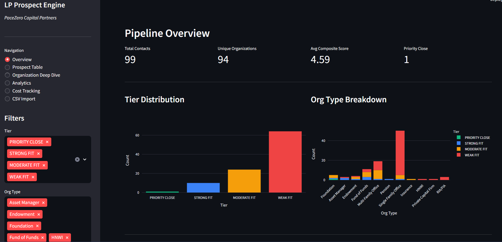
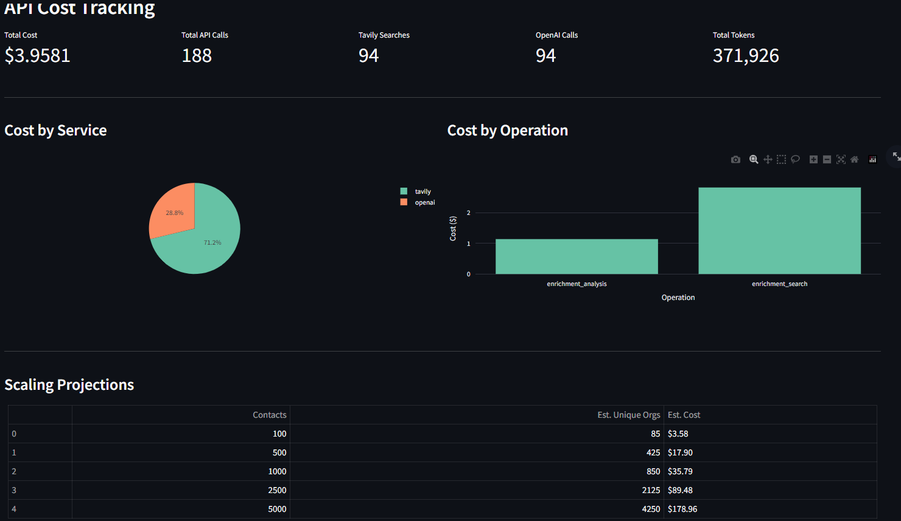

# LP Prospect Enrichment & Scoring Engine

An AI-powered data pipeline that takes a raw CSV of investor contacts, autonomously researches each organization using live web search, and scores every contact across 4 weighted dimensions to produce a prioritized fundraising list.

**Stack:** Python · OpenAI GPT-4o · Tavily Search API · SQLAlchemy · SQLite · Streamlit · Plotly



---

## How It Works

```
CSV Input
   │
   ▼
Ingestion ──── org-level deduplication, validates + normalizes contacts
   │
   ▼
Web Search ─── Tavily API: 3 targeted queries per org (investment profile,
   │            sustainability mandate, emerging manager signals)
   ▼
LLM Analysis ─ GPT-4o: org-type-aware prompts extract structured JSON
   │            (AUM, LP status, mandate, 3 dimension scores + reasoning)
   ▼
Scoring ─────── weighted composite score → tier classification → check size estimate
   │             + anomaly detection + calibration validation against anchor orgs
   ▼
SQLite DB ───── state management: pipeline is resumable, skips already-enriched orgs
   │
   ▼
Streamlit Dashboard (6 pages) + CSV export
```

---

## Scoring Model

3 dimensions are AI-generated from web research. 1 comes directly from the CRM.

| Dimension | Weight | Source |
|---|---|---|
| Sector & Mandate Fit | 35% | GPT-4o analysis of investment mandate alignment with sustainability-focused private credit |
| Relationship Depth | 30% | CSV input (pre-existing relationship strength, 1–10) |
| Halo & Strategic Value | 20% | GPT-4o assessment of brand recognition and LP signaling value |
| Emerging Manager Fit | 15% | GPT-4o signals of appetite for Fund I/II managers |

**Composite score** → tier:

| Score | Tier |
|---|---|
| ≥ 8.0 | PRIORITY CLOSE |
| ≥ 6.5 | STRONG FIT |
| ≥ 5.0 | MODERATE FIT |
| < 5.0 | WEAK FIT |

---

## Key Design Decisions

**Org-level enrichment, contact-level scoring** — Multiple contacts at the same institution share one Tavily + GPT-4o enrichment run. Scoring is then done per-contact since relationship depth is individual. Reduces API calls by ~15%.

**Two-phase enrichment** — Web search and LLM analysis are separated. Tavily fetches raw evidence first; GPT-4o analyzes the combined results in a single structured call. Keeps prompts grounded in real data rather than GPT hallucination.

**Org-type-aware prompting** — Search queries and LLM guidance differ per org type. A Foundation gets a prompt focused on its investment office and CIO; an RIA gets a prompt that first asks whether it's actually an allocator or just an advisor. Reduces systematic mis-scoring.

**Resumable pipeline** — Each org tracks `enrichment_status` (pending / enriching / done / error). A crashed or interrupted run picks up from where it left off without re-enriching completed orgs or wasting API budget.

**Calibration anchors** — After scoring, results are compared against 5 hardcoded ground-truth organizations (e.g., The Rockefeller Foundation, PBUCC). Deviations > 2 points are flagged as calibration drift, catching prompt regressions across runs.

**Anomaly detection** — Rule-based flags catch logical inconsistencies: a non-LP scored high on Sector Fit, a GP/service provider slipping through with a strong Emerging Fit, or a Foundation scoring unusually low suggesting under-researched data.

**Cost tracking** — Every Tavily search and OpenAI call is logged to the DB with token counts and estimated dollar cost, tied to a `run_id`. Enables per-run cost auditing and scaling projections.

---

## Sample Results

Full scored output for 99 contacts in `sample_output.csv`. Top prospects:

| Rank | Contact | Organization | Score | Tier |
|---|---|---|---|---|
| 1 | Roman Torres Boscan | The Schmidt Family Foundation | 8.45 | PRIORITY CLOSE |
| 2 | Manuel Alvarez | Morgan Stanley AIP | 7.80 | STRONG FIT |
| 3 | Lorenzo Mendez | The Rockefeller Foundation | 7.65 | STRONG FIT |
| 4 | Alexander Gottlieb | Neuberger Berman | 7.50 | STRONG FIT |
| 5 | Minoti Dhanaraj | Pension Boards UCC | 7.20 | STRONG FIT |

**Tier distribution across 99 contacts:** 1 Priority Close · 10 Strong Fit · 24 Moderate Fit · 64 Weak Fit

---

## Cost



~$0.04 per unique organization (3 Tavily searches + 1 GPT-4o call).

| Scale | Unique Orgs | Estimated Cost |
|---|---|---|
| 100 contacts | ~85 orgs | ~$4 |
| 1,000 contacts | ~800 orgs | ~$35 |
| 5,000 contacts | ~3,500 orgs | ~$140 |

---

## Quick Start

```bash
pip install -r requirements.txt
cp .env.example .env   # add OPENAI_API_KEY and TAVILY_API_KEY

# Full pipeline
python scripts/run_pipeline.py --csv challenge_contacts.csv

# Run phases independently
python scripts/run_pipeline.py --ingest-only --csv challenge_contacts.csv
python scripts/run_pipeline.py --enrich-only --batch-size 5
python scripts/run_pipeline.py --score-only

# Dashboard
streamlit run dashboard/app.py
```

---

## Project Structure

```
src/
├── config.py              # weights, tier thresholds, cost rates, API settings
├── pipeline.py            # orchestrator: ingest → enrich → score
├── models.py              # ORM: Organization, Contact, Score, ApiCost
├── database.py            # SQLAlchemy engine + session factory
├── cost_tracker.py        # per-call API cost logging
├── ingestion/
│   └── csv_loader.py      # CSV validation, normalization, org deduplication
├── enrichment/
│   ├── web_search.py      # Tavily client, org-type-aware query builder, retry logic
│   ├── llm_analyzer.py    # GPT-4o structured JSON extraction, validation, fallbacks
│   ├── prompts.py         # system/user prompts, scoring rubrics, org-type guidance
│   └── enricher.py        # batch enrichment orchestrator, status management
└── scoring/
    ├── dimensions.py      # composite formula, tier classification, AUM parser, check size estimator
    ├── calibration.py     # anchor validation, anomaly detection rules
    └── scorer.py          # scoring orchestrator, per-contact score writer

dashboard/app.py           # Streamlit: Overview, Prospect Table, Org Deep Dive,
                           #            Analytics, Cost Tracking, CSV Import
scripts/
├── run_pipeline.py        # CLI entry point with argparse
└── export_results.py      # export scored results to CSV
```
